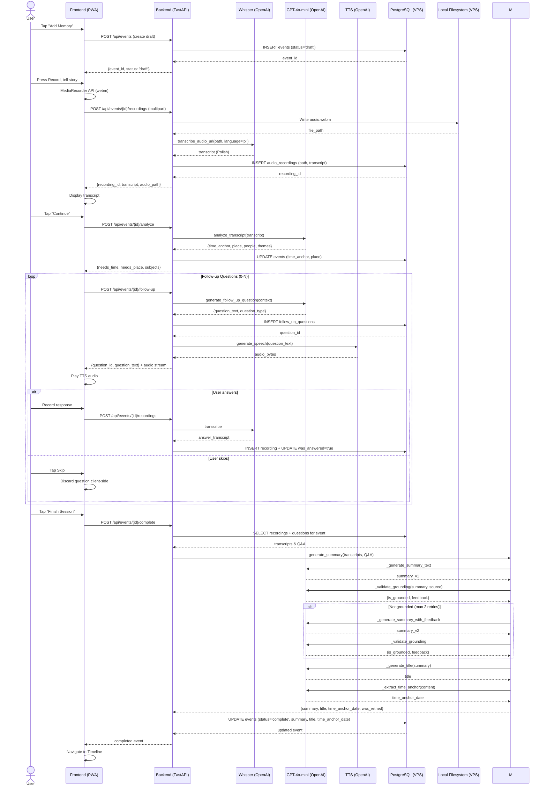
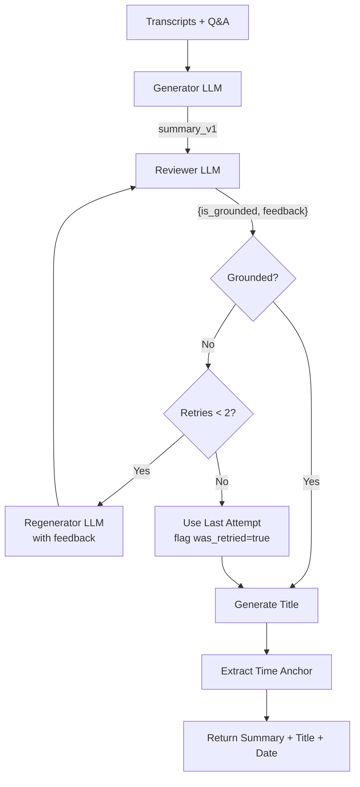
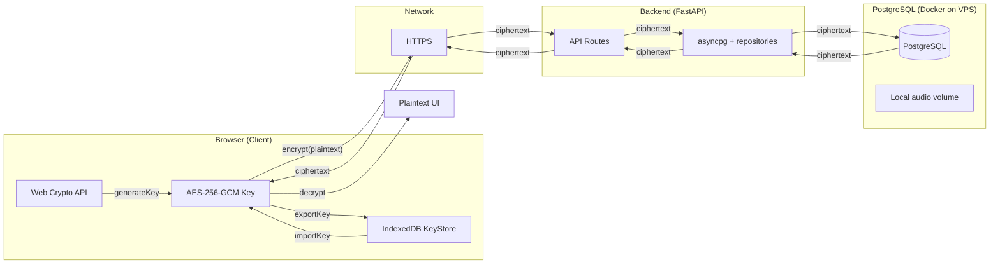
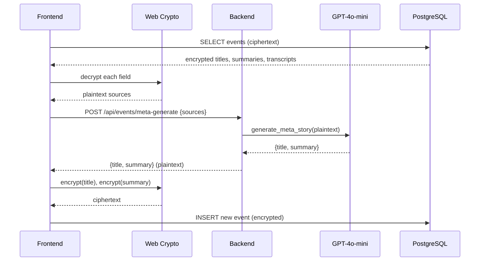
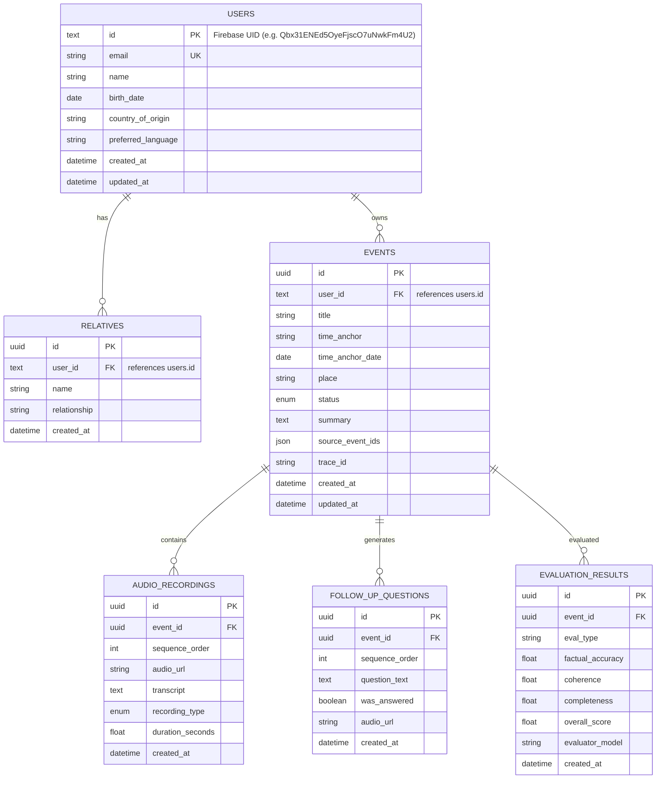
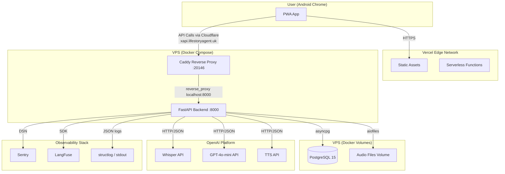
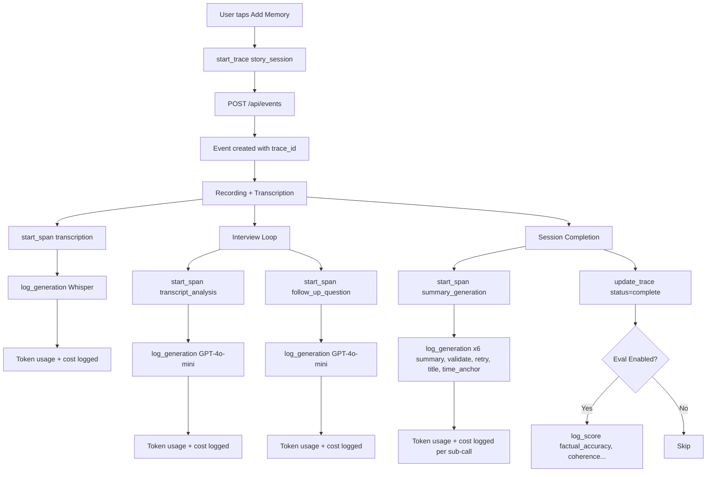
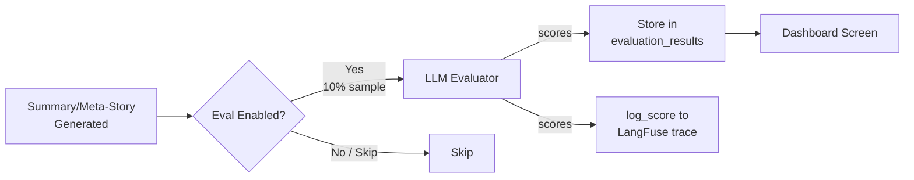

# System Design: Life Story Preservation Agent

## 1. Executive Summary

The **Life Story Preservation Agent** is a conversational AI system designed to help elderly users capture, organize, and preserve their life memories through natural voice interaction. The system acts as a patient oral historian: it records the user's spoken stories, transcribes them, asks intelligent follow-up questions to deepen the narrative, and organizes everything into a chronological timeline that can be exported as shareable legacy documents.

The primary design driver is accessibility for an 80-year-old Polish-speaking user on an Android smartphone — large touch targets, voice-first interaction, and warm, respectful AI responses.

---

## 2. High-Level System Architecture

The system follows a three-tier architecture with a Progressive Web App (PWA) frontend, a FastAPI backend, and self-hosted services (PostgreSQL + local filesystem on a VPS) with managed AI inference.

```mermaid
graph TB
    subgraph Client["Frontend (React 18 PWA)"]
        A[Login Screen]
        B[Onboarding Screen]
        C[Recording Screen]
        D[Interview Screen]
        E[Summary Screen]
        F[Timeline Screen]
        G[Event Detail Screen]
        H[Dashboard Screen]
    end

    subgraph API["Backend (FastAPI)"]
        I[Auth Middleware]
        J[Events API]
        K[Interview Agent API]
        L[TTS API]
        M[Summary Generator]
        N[Meta-Story Generator]
        O[Export Service]
        P[Evaluation API]
    end

    subgraph AI["AI Services (OpenAI)"]
        Q[Whisper STT]
        R[GPT-4o-mini]
        S[TTS gpt-4o-mini-tts]
    end

    subgraph External["Services"]
        T[(PostgreSQL 15 — VPS Docker volume)]
        U[Firebase Auth]
        V[Local filesystem — VPS Docker volume]
    end

    A --> I
    B --> J
    C --> J
    D --> K
    E --> M
    F --> J
    G --> J
    H --> P

    J --> T   (asyncpg)
    J --> V   (aiofiles)
    K --> R
    L --> S
    M --> R
    N --> R
    O --> V
    P --> T

    C -.->|audio upload| J
    J -.->|transcribe| Q
    D -.->|generate speech| L
    M -.->|validate| R
```

### Component Responsibilities

| Component | Technology | Responsibility |
|-----------|-----------|----------------|
| Frontend | React 18, Tailwind CSS, Vite | PWA with voice-first UI, client-side encryption, offline PWA shell |
| Backend | Python 3.12, FastAPI, asyncpg | REST API, auth middleware, service orchestration |
| Database | PostgreSQL 15 (Docker on VPS) | User profiles, events, recordings, questions, evaluations |
| Auth | Firebase Auth | Magic link + Google OAuth, Firebase ID tokens |
| Storage | Local filesystem (Docker volume on VPS) | Audio files served through the backend |
| LLM | OpenAI GPT-4o-mini | Transcript analysis, follow-up questions, summaries, titles |
| STT | OpenAI Whisper | Audio transcription with Polish language support |
| TTS | OpenAI gpt-4o-mini-tts | Streaming text-to-speech for questions and summaries |

---

## 3. Key Design Decisions

### 3.1 Progressive Web App (PWA) over Native App

**Decision**: Build a PWA instead of a native Android app.

**Rationale**:
- No app store submission or approval process
- Works on any phone with a modern browser
- Single codebase for all platforms
- Automatic updates via service worker
- Access to MediaRecorder API for audio capture

**Trade-off**: Limited offline capability; some native features (push notifications) deferred.

### 3.2 Client-Side Encryption

**Decision**: Encrypt all user content in the browser before sending to backend.

**Rationale**:
- Protects sensitive life stories even if backend is compromised
- Aligns with privacy-by-design principles for elderly users
- Prevents plaintext exposure in logs, backups, or DB dumps

**Trade-off**: Backend cannot search, index, or process encrypted content directly. Meta-story generation requires the Dance Flow pattern (decrypt → send plaintext → receive → encrypt → store).

### 3.3 Generator-Reviewer over Single-Pass Summarization

**Decision**: Use a two-step generate-then-validate pattern instead of a single LLM call.

**Rationale**:
- Structured output validation (`response_format=GroundingValidation`) provides deterministic fact-checking
- Retry loop with feedback improves quality measurably
- Demonstrates agentic AI pattern (bootcamp requirement)

**Trade-off**: 2-3x more LLM calls per summary, increased latency (~3-5s vs ~1s).

### 3.4 Streaming TTS over Stored Audio

**Decision**: Stream TTS audio directly to the client instead of storing audio files.

**Rationale**:
- TTS generation is fast (~500ms for short text)
- No storage management or cleanup needed
- No cache invalidation complexity

**Trade-off**: Repeated TTS for the same text regenerates audio each time.

### 3.5 Firebase Auth + Self-Hosted PostgreSQL

**Decision**: Use Firebase Authentication with a self-hosted PostgreSQL database and local filesystem storage.

**Rationale**:
- Firebase provides reliable magic link + Google OAuth authentication
- Backend verifies Firebase ID tokens directly (no Supabase Auth JWT)
- PostgreSQL 15 in Docker with a persistent volume for structured data
- Local filesystem Docker volume for audio files (no network hop, lower latency)
- Single VPS eliminates dependency on external managed services

**Trade-off**: Two separate auth systems (Firebase for auth, PostgreSQL for data) vs. a unified Supabase Auth approach. Operating the database requires VPS maintenance (backups, upgrades) vs. a fully managed service.

---

## 4. Core User Journey (Data Flow)

The following sequence diagram illustrates the complete "happy path" from the user pressing "Record" to seeing their story on the timeline.



---

## 5. Generator-Reviewer Pattern

The most critical AI component is the **Generator-Reviewer tandem** for summary generation. This pattern ensures that generated narratives remain strictly grounded in the source material, preventing hallucinations when documenting elderly users' memories.



### How It Works

1. **Generator** (`_generate_summary_text`): Creates a flowing narrative from transcripts and Q&A using a biographer system prompt. Language-aware (Polish by default).
2. **Reviewer** (`_validate_grounding`): Uses GPT-4o-mini with **structured outputs** (`response_format=GroundingValidation`) to validate that every claim in the summary has a source in the transcript. Checks for hallucinations, distortions, and missing key facts.
3. **Retry Loop**: If the reviewer rejects the summary, the feedback is passed to a regenerator with a corrected prompt. Maximum 2 retries.
4. **Title Extraction**: A separate LLM call generates a 3-8 word title from the validated summary.
5. **Time Anchor Extraction**: Another LLM call extracts the primary date for timeline sorting (e.g., "1956" → `1956-01-01`).

### Why This Matters

For elderly users, accuracy is paramount — a fabricated detail in a family legacy document is not just an error, it is a corruption of memory. The structured output validation provides deterministic grounding checks that simple prompt engineering cannot guarantee.

---

## 6. Client-Side Encryption & Dance Flow

All user-generated textual content (titles, summaries, transcripts) is encrypted **in the browser** before being sent to the backend. The backend never sees plaintext user content.



### Encryption Details

- **Algorithm**: AES-256-GCM via Web Crypto API
- **Key Management**: One key per user, generated on first login, stored in IndexedDB (never leaves browser)
- **Ciphertext Format**: `base64(iv || ciphertext || authTag)` where IV = 12 bytes
- **Graceful Degradation**: If decryption fails (e.g., missing key), the raw ciphertext is displayed rather than crashing

### The Dance Flow Pattern (Meta-Story Generation)

When combining multiple events into a meta-story, the backend cannot generate the narrative from encrypted DB data. Instead:



This **Dance Flow** ensures that:
1. All events in the database remain consistently encrypted
2. The LLM receives plaintext for coherent generation
3. The result is encrypted before persistence
4. No plaintext user content ever resides on the backend or in DB logs

---

## 7. Technology Stack

| Layer | Technology | Version | Purpose |
|-------|-----------|---------|---------|
| Frontend Framework | React | 18 | UI components, state management |
| Frontend Build | Vite | 6 | Dev server, bundling, PWA manifest |
| Styling | Tailwind CSS | 3 | Utility-first CSS, responsive design |
| UI Components | Custom (Tailwind) | — | Hand-built accessible components |
| State Management | React Context + local state | — | Auth state, profile, feature state |
| Auth Context | React Context | — | Global auth state, profile |
| Frontend Auth | Firebase JS SDK | — | Magic link + Google OAuth, ID token management |
| Backend Framework | FastAPI | 0.115 | REST API, dependency injection |
| Python | CPython | 3.12 | Runtime |
| Async HTTP | httpx | — | External APIs (OpenAI, etc.) |
| Database Driver | asyncpg | 0.31 | Async PostgreSQL client |
| Async File I/O | aiofiles | 25.1 | Local filesystem audio read/write |
| Auth/JWT | firebase-admin | — | Firebase ID token verification |
| Logging | structlog | — | Structured JSON logging |
| Rate Limiting | slowapi | — | API rate limiting |
| LLM Client | OpenAI Python SDK | — | GPT-4o-mini, TTS, Whisper |
| Database | PostgreSQL | 15 | Self-hosted (Docker volume on VPS) |
| Object Storage | Local filesystem | — | Docker volume for audio files |
| Error Tracking | Sentry | — | Exception capture |
| Tracing | LangFuse | — | Full LLM trace observability with token usage, cost tracking, and scoring |
| Hosting (BE) | VPS (Docker Compose) | — | FastAPI + PostgreSQL + Caddy containers |
| Hosting (FE) | Vercel | — | Static + edge deployment |

---

## 8. Data Model



### Key Design Notes

- **Auth Strategy**: Backend verifies Firebase ID tokens on every request via `firebase-admin` SDK. Database has no RLS (Row Level Security disabled); all data access is controlled by the API layer.
- **User ID Type**: `users.id` stores Firebase UIDs (alphanumeric strings like `Qbx31ENEd5OyeFjscO7uNwkFm4U2`). All `user_id` foreign keys are TEXT to match.
- **Ciphertext Storage**: `events.title`, `events.summary`, and `audio_recordings.transcript` contain AES-256-GCM ciphertext in production
- **Event Status**: `draft` (in-progress session) or `complete` (session ended, summary generated)
- **Meta-Story Linking**: `events.source_event_ids` is a JSON array referencing parent events for combined narratives
- **Trace Linking**: `events.trace_id` stores the LangFuse trace ID for end-to-end session observability
- **Client-Side Export**: ZIP export is generated entirely in the browser via JSZip. The frontend fetches audio blobs via `GET /api/events/{id}/recordings/{rid}/audio`, builds markdown from decrypted data, and assembles the ZIP client-side. No backend export endpoint exists.

---

## 9. Deployment Architecture



### Environment Configuration

| Service | Local Dev | Production |
|---------|-----------|------------|
| Frontend | `http://localhost:5173` | `https://www.lifestoryagent.uk` (Vercel) |
| Backend | `http://localhost:8000` | `https://xapi.lifestoryagent.uk` (Cloudflare → Caddy `:20146`) |
| Database | PostgreSQL 15 Docker container | PostgreSQL 15 Docker container (same VPS) |
| Storage | Local Docker volume | Local Docker volume (same VPS) |
| AI APIs | OpenAI (live) | OpenAI (live) |

---

## 10. Security & Privacy

### Authentication & Authorization

- **Firebase Auth**: Users authenticate via email magic links or Google OAuth. No passwords to remember.
- **Firebase ID Token Validation**: Backend validates Firebase ID tokens on every request using `firebase-admin` SDK. Tokens are verified against Firebase's public keys.
- **Admin Access**: Dashboard access controlled by comparing `current_user.email` against `ADMIN_EMAIL` environment variable.

### Data Protection

- **Client-Side Encryption**: AES-256-GCM for all user-generated text. Keys never transmitted.
- **API-Level Access Control**: All database access is controlled by the API layer which validates Firebase ID tokens before every operation. Ownership is enforced per endpoint (events and recordings are scoped to the authenticated user).
- **Private Storage**: Audio files are stored on a local Docker volume; all playback goes through authenticated streaming endpoints. The volume is not exposed directly to the internet.
- **HTTPS Everywhere**: Production terminates TLS at Cloudflare and at Caddy on the VPS (Cloudflare Origin CA certificate).

### Rate Limiting & Abuse Prevention

- **slowapi**: Rate limiting applied to all API routes.
- **File Size Limits**: 25MB max for audio uploads.
- **Content Type Validation**: Audio endpoints reject non-audio MIME types.

---

## 11. Observability & Evaluations

### Structured Logging

All backend services use `structlog` for JSON-structured logging:

```json
{
  "event": "summary_generation_completed",
  "duration_ms": 3420.5,
  "was_retried": true,
  "retry_count": 1,
  "summary_length": 1240,
  "title": "Childhood in Communist Poland",
  "has_time_anchor": true
}
```

### Error Tracking

- **Sentry**: Captures unhandled exceptions with full stack traces and request context.
- **Global Exception Handler**: FastAPI catches all unhandled exceptions, logs them, and returns sanitized 500 responses.

### LLM Tracing (LangFuse)

LangFuse is fully integrated for production LLM observability. Every user session gets a trace that spans all LLM calls across requests.



#### Trace Architecture

- **Trace Scope**: One trace per user session. `trace_id` is stored in `events.trace_id` and propagated across all subsequent requests for that event.
- **Spans**: Each major operation (transcription, analysis, follow-up, summary generation) creates a named span under the trace.
- **Generations**: Every individual LLM call is logged as a generation with prompt preview, completion preview, model name, and metadata.

#### Token Usage & Cost Tracking

Every LLM generation automatically extracts `response.usage` and computes cost:

| Model | Rate | Tracked In |
|-------|------|------------|
| GPT-4o-mini | $0.15/1M input, $0.60/1M output | All chat completions |
| Whisper-1 | $0.006/minute | Transcription calls |
| gpt-4o-mini-tts | $0.015/1K characters | TTS calls |

Costs are attached to generation metadata and visible in the LangFuse UI.

#### Error Status Tracking

When an LLM call fails, the generation is logged with `status="error"` and structured error metadata:
```python
log_generation(
    prompt="...",
    completion="",
    model="gpt-4o-mini",
    metadata={"error": "Timeout", "error_type": "APITimeoutError"},
    status="error",
)
```

#### Context Propagation

`trace_ctx` and `span_ctx` are stored as Python `ContextVar`s. Route handlers read `trace_id` from the event row and call `set_trace_context()` so services automatically attach to the correct trace without explicit parameter passing.

### Evaluation Framework

A dedicated evaluation pipeline measures AI output quality:

| Metric | Description |
|--------|-------------|
| **Factual Accuracy** | Does the summary contain only facts from the source? |
| **Coherence** | Is the narrative flowing and well-structured? |
| **Completeness** | Are key events and details included? |
| **Overall Score** | Aggregate quality metric |



- **Sampling**: Configurable via `EVAL_SAMPLE_RATE` (default 10%)
- **Storage**: `evaluation_results` table linked to events
- **LangFuse Scores**: Evaluation scores are attached directly to traces via `log_score()`:
  - Summary evals: `factual_accuracy`, `coherence`, `completeness`, `overall_score`
  - Question evals: `question_relevance`, `question_specificity`, `question_open_endedness`, `question_diversity`, `question_expected_richness`
- **Dashboard**: Admin-only endpoint (`/api/evaluations/dashboard`) with aggregate statistics
- **Evaluator Model**: Separate LLM call with structured scoring rubric

---

## 12. Planned Extensions

| Extension | Description | Status |
|-----------|-------------|--------|
| **i18n / Polish UI** | Full Polish translation of UI labels and AI prompts | **Implemented** — Polish (pl) and English (en) with 188 translation keys per locale |
| **Wikipedia Context Enrichment** | Query historical facts for event timeframe (world + Poland-specific) | Stretch goal — deferred |
| **Photo Upload Integration** | Upload photos to spark memories | Out of scope for v1 |
| **Offline Mode** | Queue recordings when offline, sync when connected | Out of scope for v1 |
| **Family Sharing** | Invite family members to view timeline | Out of scope for v1 |
| **Push Notifications** | Gentle reminders to record a memory | Out of scope for v1 |
| **Relative Date Parsing** | "When I was 10" → compute from birth_date | Deferred — basic numeric parsing covers 80% |

---

## 13. API Contract Summary

| Endpoint | Method | Auth | Description |
|----------|--------|------|-------------|
| `/health` | GET | No | Deployment health check |
| `/health/ready` | GET | No | Readiness including DB connectivity |
| `/auth/me` | GET | Yes | Current authenticated user |
| `/api/users/me` | GET/PUT | Yes | User profile CRUD |
| `/api/users/me/relatives` | POST/DELETE | Yes | Relatives management |
| `/api/events` | GET/POST | Yes | List / create events |
| `/api/events/{id}` | GET/DELETE | Yes | Event details / delete |
| `/api/events/{id}/complete` | POST | Yes | End session, generate summary |
| `/api/events/{id}/recordings` | POST | Yes | Upload audio + transcribe |
| `/api/events/{id}/recordings/{rid}/audio` | GET | Yes | Stream audio playback |
| `/api/events/{id}/analyze` | POST | Yes | Analyze transcript |
| `/api/events/{id}/follow-up` | POST | Yes | Generate follow-up question |
| `/api/events/{id}/questions` | POST | Yes | Store follow-up question |
| `/api/events/recordings/{id}/transcribe` | POST | Yes | Retry transcription for recording |
| `/api/events/recordings/{id}/transcript` | PUT | Yes | Update encrypted transcript |
| `/api/users/me/language` | PUT | Yes | Update preferred language |
| `/api/events/meta-generate` | POST | Yes | Generate meta-story from sources |
| `/api/tts/generate` | POST | Yes | Generate speech (streaming) |
| `/api/evaluations/dashboard` | GET | Admin | Evaluation statistics |
| `/api/evaluations/scores` | POST | Yes | Store evaluation scores |

---

*Document version: 2.0 | Last updated: 2026-07-30*
